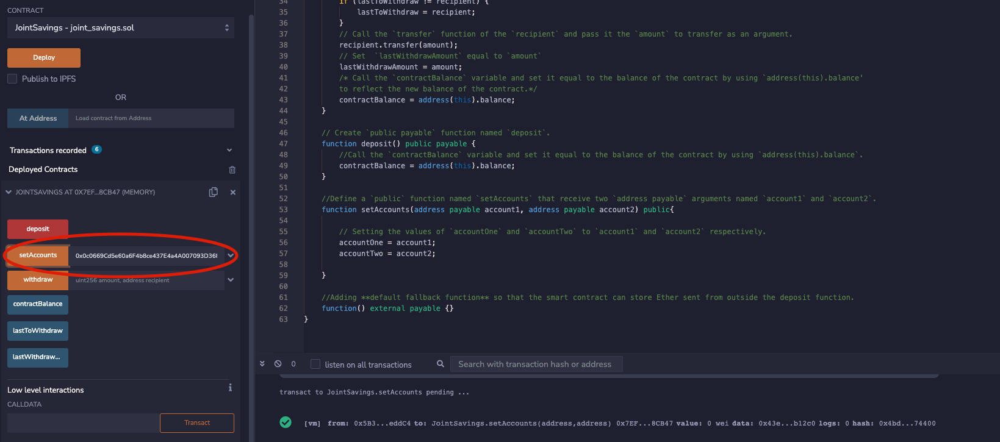
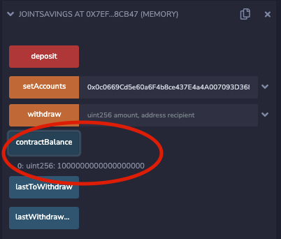
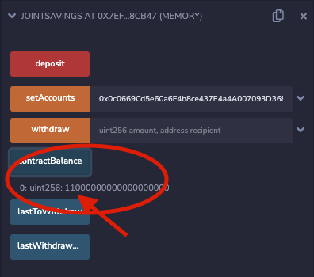
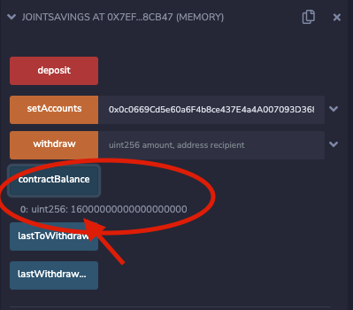
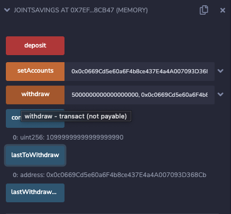
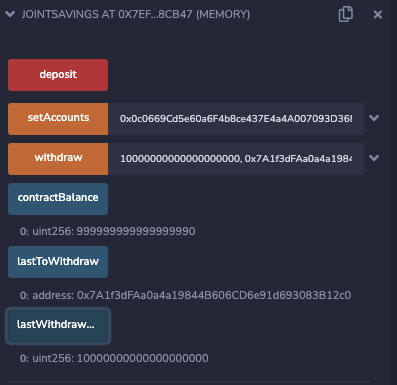

# Smart_Contract_JointSavingsAccount
Create joint savings accounts, utilizing a Solidity smart contract.


### Project Background
In this project I will use Solidity to automate the creation of joint saving accounts by creating a solidity smart contract, which accepts two user addresses that are then able to control a joint savings account. 
The smart contract will use ether management functions to implement various requirements from the "financial institution" to provide the features of the joint savings account.
The following tasks will be performed to complete this project:
1. Create and work within a local blockchain development environment, using the JavaScript VM provided by the Remix IDE.

2. Script and deploy a **JointSavings** smart contract.

3. Interact with the deployed smart contract to transfer and withdraw funds.

#### Interact with, and test functionality, of the deployed Smart Contract

To interact and test the deployed smart contract, I will complete the following steps:

1. Use the `setAccounts` function to define the authorized Ethereum address that will be able to withdraw funds from your contract.
    Addresses Used:
    > account1 address: 0x0c0669Cd5e60a6F4b8ce437E4a4A007093D368Cb
    > account2 address: 0x7A1f3dFAa0a4a19844B606CD6e91d693083B12c0
    >```

2. Test the deposit functionality of the smart contract by sending the following amounts of ether. After each transaction, use the `contractBalance` function to verify that the funds were added to your contract:
    * Transaction 1: Send 1 ether as wei.

    * Transaction 2: Send 10 ether as wei.

    * Transaction 3: Send 5 ether.


3. With a successfully deposit of funds into the smart contract, test the contract’s withdrawal functionality by withdrawing 5 ether into `accountOne` and 10 ether into `accountTwo`. After each transaction, use the `contractBalance` function to verify that the funds were withdrawn from your contract. Also, use the `lastToWithdraw` and `lastWithdrawAmount` functions to verify that the address and amount were correct.
    * Withdrawal 1: 5 ether into accountOne.

    * Withdrawal 2: 10 ether into accountTwo.

---
